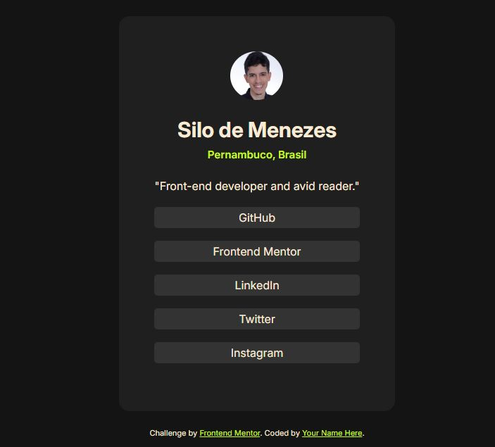

# Frontend Mentor - Social links profile solution

Esta é a minha solução para o desafio ["Social links profile challenge"](https://www.frontendmentor.io/challenges/social-links-profile-UG32l9m6dQ). na plataforma [Frontend Mentor](https://www.frontendmentor.io/home). Os desafios da Frontend Mentor ajudam você a melhorar suas habilidades de código ao construir projetos realistas.
## Tabela de conteúdo

- [Visão Geral](#visão-geral)
  - [O Desafio](#o-desafio)
  - [Screenshot](#screenshot)
  - [Links](#links)
- [Meu processo](#meu-processo)
  - [Feito com](#feito-com)
  - [O que eu aprendi](#o-que-eu-aprendi)
  - [Recursos Úteis](#recursos-úteis)
- [Autor](#autor)

## Visão Geral

### O Desafio

O desafio involve criar uma página de perfil social, com links funcionais para perfils em outras redes sociais. Os elementos interativos da página também devem mudar de cor quando o muse estiver sobre eles.

### Screenshot



### Links

- Solution URL: [Add solution URL here](https://your-solution-url.com)
- Live Site URL: [Add live site URL here](https://your-live-site-url.com)

## Meu processo
### Feito com

- Semantic HTML5 markup
- CSS custom properties
- Flexbox

### O que eu aprendi

Eu não conhecia o "universal selector", ou seletor universal (*) antes de começar este projeto. Aprendi como ele funciona enquanto pesquisava formas de deixar o design do projeto o mais próximo o possivel do exemplo. Considero ele uma ferramenta muito útil e gostaria de ter aprendido sobre ele mais cedo.

```css
* {
    padding: 0;
    margin: 0;
}
```

###  Recursos Úteis

- [Google Fonts](https://fonts.google.com/) - Forneceu a fonte usada no desafio que me permitiu deixar a versão final mais parecida com o design desejado no desafio.

## Autor

- LinkedIn - [Silo de Menezes](www.linkedin.com/in/silo-menezes-648920197)
- Frontend Mentor - [Silo30](https://www.frontendmentor.io/profile/Silo30)
